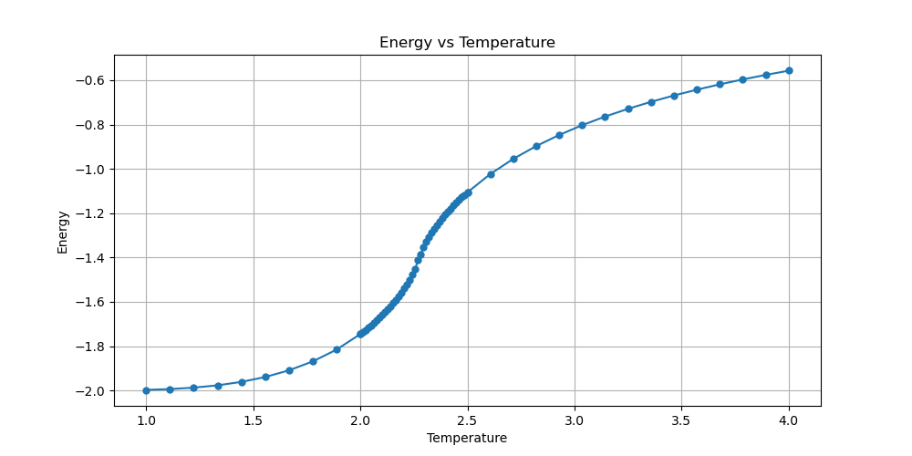
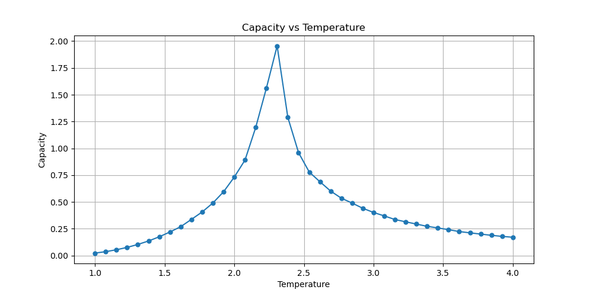
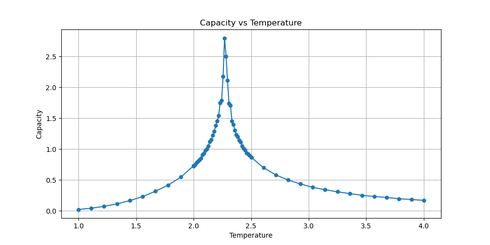
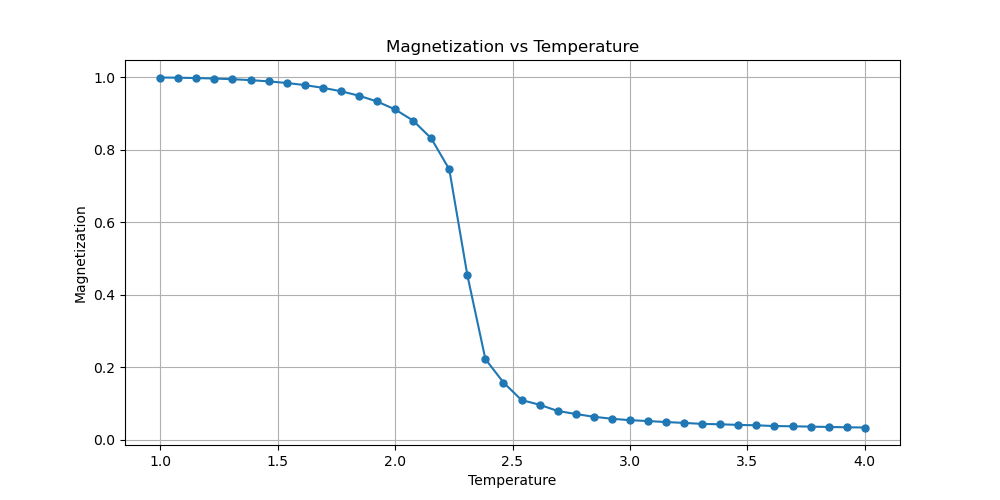
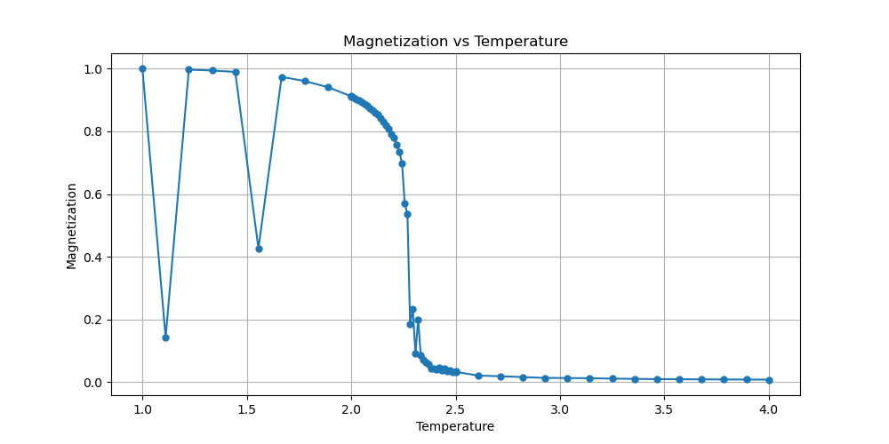
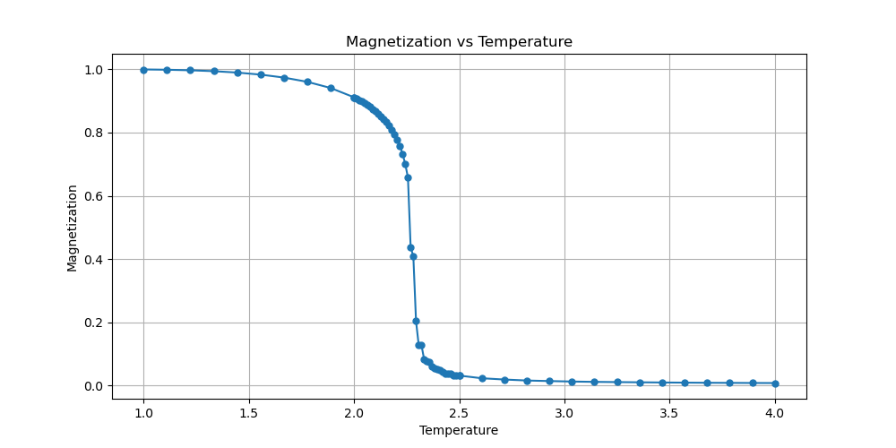

### Ising-model Simulation
> 并尝试Git仓库
#### Introduction
> 也许明天会写（逃
#### 格点数量的影响
在进行模拟时，发现需要达到100x100的格点数量才能看到比较明显的相变现象，此时模拟的结果会开始变得尖锐，与理论预期较为吻合。而在较小的格点数量下（如20x20），相变现象并不明显，结果较为平滑。这个现象相当有趣，反映了尺寸对系统行为的影响。
另一方面，最开始采取了热启动的方式，即使用随机的格点网络开始演化。使用这个方法在低温情况下可能会形成磁畴，即局部的自旋方向一致的区域，导致整体的磁化强度减小。为了避免这个问题，改为冷启动，即所有格点初始时刻都取相同的自旋方向（+1或-1）。这种方式下，低温下的模拟结果变得更加平滑，符合预期的物理行为。当然，更物理的方法是使用退火算法，即降低温度后使用前一温度下的最终状态作为下一温度的初始状态，这样可以更好地模拟实际物理过程。但这里没有尝试。
#### 结果展示

    

200x200格点下的平均能量随温度变化图，该图在不同格点数下看起来变化都不是很大。其中相变处能量变化梯度最大，与后面的热容图相呼应。
<table align="center" style="border-collapse:collapse;">
    <tr>
        <td style="padding:2px; width:50%;">
            
        </td>
        <td style="padding:2px; width:50%;">
            
        </td>
    </tr>
</table>
以上分别是50x50和200x200格点模拟下的热容，可以看到200x200的结果相变处明显更尖锐，更符合理论预期。
<table align="center" style="border-collapse:collapse;">
    <tr>
        <td style="padding:2px; width:33.33%;">
            
        </td>
        <td style="padding:2px; width:33.33%;">
            
        </td>
        <td style="padding:2px; width:33.33%;">
            
        </td>
    </tr>
</table>
从左到右分别是50x50（热启动）、200x200（热启动）、200x200（冷启动）格点下的磁化强度随温度变化图。可以看到200x200下的结果相变，而热启动在格点数较多，温度较低时会出现因磁畴形成的异常点。这些异常点也会出现在能量图中，表现为能量的轻微上升，不作展示。
